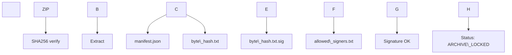

\# RIS K0 — Technical Overview (Provenanced Model)


This document provides a complete, factual description of the canonical RIS K0 release bundle, its provenance layer, verification flow, and internal structure.  

All content refers to the artifacts contained in `RIS\_K0\_provenanced.zip`.


Status: \*\*ARCHIVE\_LOCKED\*\*  

All hashes and signatures are immutable.


---


\## 1. Release Structure


The canonical release contains:


1\. `RIS\_K0\_provenanced.zip`  

2\. `RIS\_K0\_provenanced.zip.sha256`  

&nbsp;  - GNU sidecar format: \*\*two spaces\*\* between hash and filename.


Consumers verify the ZIP, extract it, then validate provenance and signature.


---


\## 2. Verification Overview


\### 2.1 ZIP Integrity (SHA256)

\- Hash file: `RIS\_K0\_provenanced.zip.sha256`

\- Format: `<sha256>␣␣RIS\_K0\_provenanced.zip`


\### 2.2 Provenance \& Signature

All provenance files live in:


```

provenance/

&nbsp; manifest.json

&nbsp; provenance.json

&nbsp; semantic\_hash\_ns.txt

&nbsp; source\_date\_epoch.txt

&nbsp; byte\_hash.txt

&nbsp; byte\_hash.txt.sig

&nbsp; allowed\_signers.txt

```


Signature verification uses:


```

ssh-keygen -Y verify \\

&nbsp; -f provenance/allowed\_signers.txt \\

&nbsp; -I maintainer \\

&nbsp; -n RIS\_K0 \\

&nbsp; -s provenance/byte\_hash.txt.sig < provenance/byte\_hash.txt

```


Expected signer fingerprint (ED25519):


```

SHA256:En+c93lQGMAnjkd680oK0DPKYq3tpZ4ug8QXnjTiZys

```


---


\## 3. Provenance Model


The provenance system encodes three orthogonal dimensions:


\### 3.1 Semantic Provenance

\*\*`semantic\_hash\_ns.txt`\*\*  

Stable namespace hash summarizing the conceptual structure of the model.  

Format: ASCII, LF, single line.


\### 3.2 Deterministic Build Origin

\*\*`source\_date\_epoch.txt`\*\*  

Defines the UNIX epoch timestamp ensuring deterministic, reproducible builds.


\### 3.3 Byte-Level Canonical Integrity

\*\*`byte\_hash.txt`\*\*  

SHA512 digest representing all byte-relevant content in the release.


\*\*`byte\_hash.txt.sig`\*\*  

Detached ED25519 signature created via `ssh-keygen -Y sign`.


\*\*`allowed\_signers.txt`\*\*  

Declares the maintainer’s public key and signature constraints.


\### 3.4 Manifest

\*\*`manifest.json`\*\*  

Machine-readable mapping of all canonical files: paths, sizes, hashes.


\### 3.5 Meta-Record

\*\*`provenance.json`\*\*  

Records metadata (tool versions, timestamps, release state).  

Allowed: `status in {"DRAFT","FROZEN","ARCHIVE_LOCKED"}`.


---


\## 4. Canonical Verification Flow


\*\*Sequence:\*\*


```

ZIP

&nbsp;→ SHA256 verification

&nbsp;→ Extract bundle\_root/

&nbsp;→ Read manifest.json

&nbsp;→ Read byte\_hash.txt

&nbsp;→ Verify byte\_hash.txt.sig via allowed\_signers.txt

&nbsp;→ Check provenance.json.status == ARCHIVE\_LOCKED

&nbsp;→ OK

```


Mermaid diagram:





---


\## 5. Bundle Layout


```

bundle\_root/

&nbsp; README.txt

&nbsp; views/

&nbsp; spec/

&nbsp; kernel/

&nbsp;   objects\_K0.json

&nbsp; reports/

&nbsp;   kernel\_stats.tsv

&nbsp; logs/

&nbsp;   migration\_log.tsv

&nbsp; docs/ (optional)


provenance/

&nbsp; manifest.json

&nbsp; provenance.json

&nbsp; semantic\_hash\_ns.txt

&nbsp; source\_date\_epoch.txt

&nbsp; byte\_hash.txt

&nbsp; byte\_hash.txt.sig

&nbsp; allowed\_signers.txt

```


---


This overview describes the canonical frozen state of the RIS K0 release and its full verification pathway.


