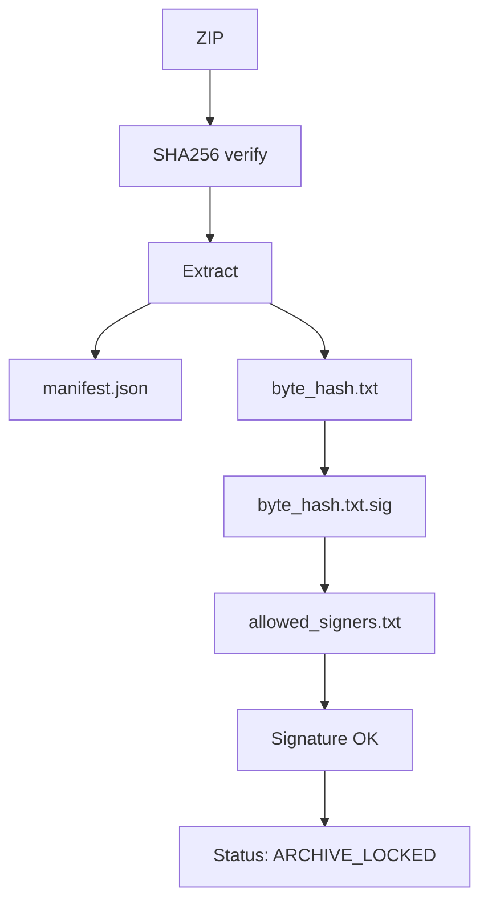

# RIS K0 — Technical Overview (Provenanced Model)

> Pending references to fill before publishing:
>
> * Release tag: `__________________________`
> * Bundle filename: `__________________________.zip`
> * Expected maintainer fingerprint (ED25519, SSH-style): `__________________________`
> * Source-Date-Epoch (optional): `__________________________`
> * Semantic namespace hash (optional): `__________________________`

Status: **ARCHIVE_LOCKED**
Scope: factual description of the canonical RIS K0 release bundle, its provenance layer, verification flow, and internal structure. All content refers to the artifacts contained in `RIS_K0_provenanced.zip`. All hashes and signatures are immutable.

---

## 1. Release Structure

The canonical release consists of:

1. `RIS_K0_provenanced.zip`
2. `RIS_K0_provenanced.zip.sha256`

   * Format follows GNU sidecar convention (two spaces between hash and filename).
   * Verifiers should compare the 64-hex digest; incidental whitespace is not material.

Consumers verify the ZIP, extract it, then validate provenance and signature.

---

## 2. Verification Overview

### 2.1 ZIP Integrity (SHA256)

* Hash file: `RIS_K0_provenanced.zip.sha256`
* Format: `<sha256>␠␠RIS_K0_provenanced.zip`
* Acceptance criterion: computed SHA256 of the ZIP equals the reference digest.

### 2.2 Provenance and Signature (OpenSSH)

All provenance files live in:

```
provenance/
  manifest.json
  provenance.json
  semantic_hash_ns.txt
  source_date_epoch.txt
  byte_hash.txt
  byte_hash.txt.sig
  allowed_signers.txt
```

Signature verification:

```
ssh-keygen -Y verify \
  -f provenance/allowed_signers.txt \
  -I maintainer \
  -n RIS_K0 \
  -s provenance/byte_hash.txt.sig < provenance/byte_hash.txt
```

Expected signer fingerprint (ED25519), compare against the published value in release notes:

```
SHA256:__________________________
```

Acceptance criterion: signature verification success with the published maintainer identity.

---

## 3. Provenance Model

The provenance system encodes four orthogonal components. All files are ASCII, LF-only.

### 3.1 Semantic Namespace (optional but recommended)

**`semantic_hash_ns.txt`**
Single-line, stable hash summarizing the conceptual namespace of the model (not a byte-level digest).
Purpose: identifies the abstract namespace used by the bundle’s specifications.

### 3.2 Deterministic Build Origin

**`source_date_epoch.txt`**
UNIX epoch timestamp used to stabilize time-dependent build metadata.
Purpose: contributes to reproducible packaging by pinning the build epoch.

### 3.3 Byte-Level Canonical Integrity

**`byte_hash.txt`**
Canonical digest over all byte-relevant content in the release.
Recommended algorithm: SHA512; format: single line of hex.

**`byte_hash.txt.sig`**
Detached ED25519 signature produced by `ssh-keygen -Y sign` over `byte_hash.txt`.

**`allowed_signers.txt`**
OpenSSH allowed-signers file declaring the maintainer’s public key and identity label used at verification (`-I maintainer`) and the expected namespace (`-n RIS_K0`).

### 3.4 Manifest

**`manifest.json`**
Machine-readable mapping of all canonical files in the ZIP (forward-slash path separators), including `path` and `size` per entry.
Purpose: enables strict ZIP↔manifest set equality checks.

### 3.5 Meta-Record

**`provenance.json`**
Records meta-information (tool versions, timestamps, digests, release state).
Allowed status values: `"DRAFT"`, `"FROZEN"`, `"ARCHIVE_LOCKED"`.
Acceptance criterion: `"status": "ARCHIVE_LOCKED"` for a public, frozen release.

---

## 4. Canonical Verification Flow

**Sequence:**

```
ZIP
  → SHA256 verification
  → Extract bundle_root/
  → Read release/manifest.json (if present at top-level; otherwise provenance/manifest.json)
  → Read provenance/byte_hash.txt
  → Verify provenance/byte_hash.txt.sig via provenance/allowed_signers.txt
  → Confirm provenance/provenance.json.status == "ARCHIVE_LOCKED"
  → OK
```

**Mermaid diagram (informative):**



Acceptance criteria at each stage are binary; any failure invalidates the artifact.

---

## 5. Bundle Layout

Illustrative layout (authoritative set is defined by `manifest.json`):

```
bundle_root/
  README.txt
  views/
  spec/
  kernel/
    objects_K0.json
  reports/
    kernel_stats.tsv
  logs/
    migration_log.tsv
  docs/                # optional, ASCII/LF

provenance/
  manifest.json
  provenance.json
  semantic_hash_ns.txt
  source_date_epoch.txt
  byte_hash.txt
  byte_hash.txt.sig
  allowed_signers.txt
```

Notes:

* Paths in `manifest.json` use `/` separators independent of platform.
* Directory entries may be omitted from the manifest; equality is over file entries.

---

## 6. Policies and Constraints

* **ARCHIVE_LOCKED**: no re-packing, no mutation of ZIP or sidecars. Distribution must preserve the sidecars.
* **Encoding**: all textual artifacts are UTF-8 without BOM, LF-only.
* **Docs discipline**: public documentation is ASCII/LF and machine-linted.
* **RFS/FPC**: documents under `docs/` are informational; they do not introduce kernel IDs.
* **Verification**: consumers MAY implement equivalent verification; acceptance must match the criteria in Sections 2 and 4.

---

## 7. Compatibility

* **OpenSSH**: `ssh-keygen -Y verify` requires OpenSSH ≥ 8.2.
* **Windows**: use built-in OpenSSH client feature or recent Git for Windows which bundles OpenSSH.
* **Hash tools**: `sha256sum` on POSIX; `Get-FileHash` on PowerShell.

---

## 8. Release Notes Binding (informative)

The public release notes MUST publish:

* the bundle filename,
* the expected ED25519 fingerprint of the maintainer key, and
* any optional semantic/build values (namespace hash, Source-Date-Epoch).

These values are considered part of the verification contract for the release.

---

This overview describes the canonical frozen state of the RIS K0 release and its full, machine-checkable verification pathway.
